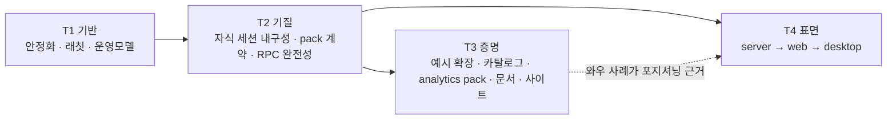

# Aelix — 베타 이후 방향 정리 (2026-09-15)

> **정본은 `docs/05-post-beta-direction.md`다** (2026-09-15 두 초안을 합침). 이 파일은 세션 기록으로 남긴다.
> Codex 교차 검토(`review-direction-post-beta2-codex-2026-09-15.md`)가 정정한 세 가지는 아래 본문에도 고쳐 두었다:
> `parent_id`는 엔트리 트리 부모(fork 전용 아님) · RPC는 승인 응답 타입을 인식한 뒤 버린다(핸들러 부재가 아니라 브리지 미완) ·
> C901 40 초과는 두 함수가 아니라 여섯이다. 정본이 채택하지 않은 것(날짜 일정 · 예제/패키지 최소 개수 · 전체 RPC parity 선행 · 48시간 응답)은 그쪽 판단을 따른다.

기준점: `main` 026bd15 · v0.1.0-beta.2 (2026-09-09) · beta.1 (2026-08-20).
이 문서는 오너가 2026-09-15에 나열한 고민 12가지를 **측정값 위에** 다시 배열한 것이다.
측정 명령과 출처는 §10에, Codex 초안과의 대조는 §9에 있다. 숫자는 전부 이 날짜의 실측이고, 추정은 "추정"이라 적었다.

---

## 0. 한 줄 결론

나열한 12가지는 독립된 12개 트랙이 아니라 **의존 관계가 있는 4개 트랙**이다.

```
T1 기반   안정화 · 복잡도 래칫 · 운영모델(트리아지/기여자)        ── 상시, 다른 트랙의 전제
T2 기질   세션 내구성(자식 포함) · 확장=제품 계약(pack) · RPC 완전성 ── 차별화의 실체
T3 증명   예시 확장 · 카탈로그≠0 · analytics pack · 문서 · 사이트   ── T2 계약 위에서만 의미
T4 표면   aelix server → 웹 → (데스크탑)                         ── T2가 증명된 뒤
```

- **T3는 T2의 pack 계약이 확정된 뒤에** 만들어야 한다. 그 전에 예시 확장 10개를 만들면
  계약이 바뀔 때 10개를 다시 쓴다.
- **T4는 T2의 세션 내구성과 RPC 완전성이 끝난 뒤에** 연다. 그 전에 서버·웹을 열면 TUI가
  가진 결함(자식 세션 미기록, RPC 갭)을 표면 셋이 나눠 갖는다.
- T1은 릴리즈마다 계속 간다. 다만 **빅뱅 리팩토링은 하지 않는다** — 래칫으로 간다(§4.1).

한 사람이 병렬 세션을 돌리는 현재 방식이면 **동시 레인은 둘**이 상한이다:
"기반 레인" 하나 + "기질/증명 레인" 하나. 릴리즈마다 헤드라인은 **하나**.

---

## 1. 지금 위치 — 측정값

| 영역 | 측정값 | 읽는 법 |
|---|---|---|
| 릴리즈 | beta.1 08-20 → beta.2 09-09. PyPI 4 프로젝트 | 3주 케이던스가 한 번 성립 |
| 코드 | packages 약 125K 줄 · 테스트 파일 546 · 스위트 약 10.6K 건 · ADR 237 | 크기는 이미 "한 사람이 다 아는" 범위를 넘었다 |
| 이슈 | open **141** · 최근 30일 생성 **119** / 종료 **55** · **그중 12건은 beta.2에서 머지됐는데 아직 열려 있다**(#198 #239 #240 #241 #243 #244 #247 #248 #249 #251 #142 #172 — 보드는 In progress 10·Backlog 2, 닫힌 것은 #250뿐) | 순증 +64/월이지만 **열린 수 = 미구현 수가 아니다.** 완료 대조가 트리아지보다 먼저다 (Codex 초안이 잡아냈다) |
| 라벨·마일스톤 | 라벨은 GitHub 기본 9개뿐, 마일스톤 2개(v0.1.0, Windows) | 141개 중 대부분 라벨·마일스톤 없음 → 트리아지 부재 |
| 커뮤니티 | stars 11 · forks 2 · 외부 PR 3 (**2건은 메인테이너 선착으로 폐기** #217 #223) | 기여자 병목은 CI가 아니라 작업 클레임 |
| 복잡도 (radon, 중첩 포함) | 함수·메서드·클로저 **4,774** · CC>20 **74** · >40 10 · >50 **5**: `_async_main` 109 · **`parse_args` 92**(`cli/args.py:351`) · `stream_openai_completions` 82 · `process_responses_stream` 57 · `build_params` 53 | "전반적으로 나쁨"이 아니라 **세 군데**: CLI 진입(entry·args), provider 스트림/호환 분기, TUI 셸. 처음 적었던 3,592/D+64는 클래스 메서드·클로저를 빼먹은 집계라 폐기 |
| MI≈0 파일 | `harness/core.py` 4,815줄 · `cli/extension_install.py` 4,491 · `cli/entry.py` 3,300 · `settings_manager.py` 1,875 · `openai_completions.py` 1,559 | MI는 부피 지표다 — 이 다섯은 "넓다" |
| 깊은 함수 (ruff C901 >40) | 6개: **`run_tui` 248** · `_async_main` 82 · `parse_args` 80 · `stream_openai_completions` 54 · `run_print_mode` 42 · `process_responses_stream` 42. `core.py`·`extension_install.py`에는 없다(각 121·104개의 작은 함수) | 두 측정기의 차이는 **클로저 처리**다: radon은 중첩 함수를 따로 세고(그래서 `run_tui` 자체는 낮다), ruff는 부모에 합산한다(248). `run_tui`가 2,734줄 클로저 공장이라는 사실은 어느 쪽으로 봐도 같다 |
| 생태계 | 공식 카탈로그 entry **0** · 예시 확장 실질 **3**(echo·selfhosted·starter; telnaut은 빈 디렉터리) | "확장 플랫폼"의 공급이 0 |
| 멀티에이전트 | 자식은 `--mode json -p --no-session`으로 뜬다(`agents/resolver.py:306`) · `[features] agents` 기본 off · beta.2에서 자식 3/3 실패(#262) | 세션 기록 없음(#199)은 설계값이고, b2는 아예 깨져 있다 |
| 서버 | `aelix-server` **392줄**(WS /rpc 스켈레톤) · 문서 0(#275) · RPC 29 명령 문서 0(#271) | 서버는 아직 "있다"고 말할 단계가 아니다 |
| 문서 | 가이드 9개/약 120KB vs pi 30개/478KB · RPC 100%·hook 92%·settings 83%·키바인딩 76% 미문서(#264 실측) | 특정 표면이 한 번도 패스를 못 받았다 |
| 사이트 | `site/index.html` 1장(설치 + 특징 3) · 마켓플레이스는 별도 레포 `aelix-marketplace` | 통합 사이트 없음 |
| analytics | `~/dev/aelix-extensions/aelix-analytics` 27K 줄 · 로컬 프로토타입 · manifest 없음 · 자체 CLI+서버 · **Python 3.12+**(aelix는 3.11+) | 아직 aelix 확장이 아니고, 인터프리터 요구가 본체와 다르다 |

---

## 2. 핵심 진단 셋

**1. 유입이 처리를 앞선다 — 그리고 장부가 틀려 있다.** +64/월 순증을 한 사람이 받는데, 그 141건 중 12건은
이미 beta.2로 나간 것이다. 12개 트랙을 동시에 열면 전부 반쯤 된 채로 남는다. 필요한 것은 더 많은 병렬이
아니라 **완료 대조 → WIP 제한 → 우선순위 규칙**이다. 이슈마다 재현됨 / 수정됐으나 종결 대기 / 설계 필요 /
중복·대체됨 넷 중 하나로 먼저 판정한다(Codex 초안 §2의 규칙을 그대로 채택).

**2. 비전과 출하물의 간극이 곧 차별화 지점이고, 그 간극은 마케팅이 아니라 두 번째 제품이 메운다.**
#86(2026-07-11 오너 확정)은 "Agent OS / 범용 runtime 언어는 **신뢰성 있는 2번째 first-party
pack 전까지 금지**"를 걸어 놓았다. 지금 고민하는 것(substrate·확장=제품·서버·웹)은 정확히 그
금지를 푸는 방향이다. 푸는 열쇠는 문구가 아니라 **aelix-analytics가 실제로 aelix 위에서
pack으로 도는 것**이다. 그래서 analytics는 사이드 프로젝트가 아니라 **substrate의 증명**이다. 그리고 substrate 주장에는 실측된
구멍이 하나 있다 — **커널이 코딩 에이전트를 import한다**(§4.2(e)). 주장하기 전에 막는다.

**3. 기여자 준비의 병목은 CI가 아니다.** 게이트 3종·PR 템플릿·CONTRIBUTING·SECURITY·SBOM·
서명 카탈로그는 이미 있다. 없는 것은 (a) 라벨·마일스톤·트리아지, (b) "누가 잡았는지" 규약,
(c) 복잡도·보안 자동 게이트, (d) 기여자용으로 분리된 AGENTS.md다.

---

## 3. 트랙 의존 관계



---

## 4. 트랙별 상세

### 4.1 T1 기반 — 안정화 · 복잡도 · 운영모델

**안정화 우선순위 규칙** (이 순서로 잡는다):

0. **완료 대조부터.** beta.2에서 머지된 12건을 검증 후 종결하고 보드를 Done으로 옮긴다(CLAUDE.md 2항이
   요구하는 "이슈를 닫기 전에 보드와 문서를 같이"가 이번엔 반대로 빠졌다). CHANGELOG beta.2 절이 언급하는 셋 중
   #256·#259는 known-issue로 적혀 있어 열려 있는 게 맞고, **#258은 "이 릴리즈의 #258이 실린다"고 적혀 있다** —
   13번째 후보이니 같이 대조한다. 반나절 작업이고, 그 뒤의 숫자가 전부 달라진다.
1. 데이터 손실·보안: #137(두 터미널 한 세션 → 턴 소실) · #188(MCP/skills 툴이 승인·PLAN 모드 우회)
   · #138(세션 JSONL 무편집 저장) · #260/#261(bash 출력 꼬리 손실)
2. 헤드라인 기능 회귀: **#262(멀티에이전트 b2에서 3/3 실패)** · #285(text_end만 온 블록 미표시)
   · #286(print/json/rpc가 defaultThinkingLevel 무시) · #258/#259/#256(thinking 요청 오류)
3. CLI 라우팅: #289/#288(`--offline` 위치·오프라인 판정 3곳 불일치) — **entry.py 라우터 분할과
   같이 잡는다**(아래)
4. 나머지 TUI 25건은 라이브 체크 문서(`windows-live-check-beta2.md`)처럼 **표면별 체크리스트로
   묶어서** 한 배치에 처리

**복잡도 — 빅뱅 금지, 래칫.** 평균은 A다. 깊이 문제는 함수 둘(`run_tui` 248, `_async_main` 82),
부피 문제는 파일 다섯이고, 그중 셋은 이미 열려 있는 버그와 겹친다. 원칙:

- CI에 래칫을 건다: **ruff `C901`로 상한을 두되, 이미 넘는 여섯 함수는 `# noqa`로 숨기지 말고 함수별 기준선과
  비교**(숨기면 악화를 못 본다 — Codex 지적). 건드린 함수가 기준선을 넘으면 분할. 총량을 줄이는 게 아니라
  **늘지 않게** 하는 것부터(측정 명령은 아래).
- `cli/entry.py`의 `_async_main`(1820–3172, 1,353줄; radon CC 109, ruff mccabe 82 — 측정기가 다르지 이견은 없다)은 argv 라우팅이다. #289가 "라우팅이 argv[0]만 본다"는 바로 그
  블록의 버그이므로, **서브커맨드 라우터(command pattern)로 쪼개는 리팩토링이 버그 수정을
  지불한다.** `aelix install` 별칭(§4.3)도 여기서 나온다.
- `harness/core.py` 4,815줄 `AgentHarness`: compaction/overflow(`_try_overflow_recovery`,
  `_check_auto_compaction`, `compact`), tree navigation(`navigate_tree`), session write
  (`flush_pending_session_writes`)이 각각 radon D급(21~30)이다. 이 셋은 이미 `session/compaction.py`가
  있으니 **위임 seam이 존재한다** — 옮기는 것이지 다시 쓰는 것이 아니다.
- `cli/extension_install.py` 4,491줄: 소스 종류(pypi/git/local/catalog)별 분기가 한 파일에 있다.
  **strategy per source kind**로 나누는 것이 자연스럽고, pack 계약(§4.2)이 들어올 때 어차피
  건드린다 — 그때 같이.
- **`cli/args.py:351` `parse_args`(radon 92 / ruff 80)는 처음 집계에서 빠져 있었다.** entry.py 라우터와 같은 뿌리
  (플래그 표가 코드로 펼쳐져 있다)이므로 같은 이슈 묶음에서 **선언적 플래그 표 + 서브파서**로 함께 간다.
- provider 층이 세 번째 군집이다: `stream_openai_completions` 82 · `build_params` 53 · `process_responses_stream` 57 ·
  `detect_compat` 48 · `stream_anthropic` 46 · `convert_messages`(google) 45. Codex 초안의 처방이 맞다 — **모델별
  호환 분기를 검증된 정책 데이터(models.json compat)로 내리고 어댑터는 얇게.** 단 **live 검증 없이는 손대지
  않는다**(CLAUDE.md 10), 그리고 #61(provider 라이브 스모크)이 먼저 있어야 이 리팩토링을 안전하게 할 수 있다.
- **래칫을 속이지 않는다.** 짧은 함수로 쪼개 수치만 낮추거나 조건문을 클래스로 바꾸는 것은 완료가 아니다.
  완료 기준은 "다른 구현으로 바꿔도 호출부 수정이 없고, 실제 lifecycle까지 연결되는가"다(Codex 초안 §5).

**리팩토링 seam — 실측(읽기 전용 감사, 2026-09-15).** 넷 중 셋은 **저자가 이미 경계를 그어 놓았다.**
옮기는 것이지 다시 설계하는 것이 아니다.

| 파일 | 이미 있는 seam | 잘라낼 것 (대략 줄 수) |
|---|---|---|
| `harness/core.py` 4,815 | `bind_core(_RuntimeActions(...))` **:653–681**이 18개 `_action_*`를 키워드 표로 나열 · 배너 `# === Internal: callback bridges ===` **:3404** · 배너 `auto-retry state machine` **:1997** | (a) extension action 표 + context 팩토리 **:3406–3983** ≈570 → `_extension_actions.py` · (b) hook/provider emit 브리지 **:3984–4317** ≈334(+세션 lifecycle emit ≈88) → `_hook_bridges.py` · (c) auto-compaction+auto-retry **:1735–2129** ≈380 → `_recovery.py`(호출점은 `prompt()` 4곳) · 보너스 `Pending*Write` 8종+dispatcher **:317–404, :3030–3100** ≈160 |
| `cli/entry.py` 3,300 | **유일한 진짜 seam은 early-exit verb 체인 :1831–1939**(`extension`·`docs`·`status`·`--help`·`--version`·`--list-models`·`--export`) · 종단 dispatch 3-arm **:3041/:3090/:3121**(interactive/rpc/print) | (a) verb 체인 → `try_early_exit(argv, parsed) -> int \| None` ≈110 — **C901 점수를 가장 크게 깎는 한 컷**(#289의 "argv[0]만 본다"가 바로 이 자리) · (b) 세션 해석+resume 피커 **:376–718** ≈343(이미 연속) → `_session_startup.py` · (c) prompt-file+system-prompt 조립 **:776–908, :1187–1320** ≈265 → `_prompt_sources.py`(#287 SYSTEM.md가 들어갈 자리) |
| `cli/extension_install.py` 4,491 | `# === … ===` 섹션 배너 + `run_extension_command_async`의 `if sub == …` 11-verb 체인 **:4402–4470** | (a) Ed25519 keygen/sign/trust **:3866–4242** ≈380(SettingsManager 생성 **전**에 라우팅되므로 공유 상태 0) → `ext_signing.py` · (b) source-list 영속+`source` verb **:1797–2279** ≈490 → `ext_sources.py` · (c) pip↔uv ambient index **:595–1010** ≈415(순수 함수, 직접 테스트 가능) → `ext_index_config.py` · 4번째 manifest-binding **:2280–2754** ≈470 |
| `tui/shell.py` 3,918 | `run_tui` **:452–3185**(2,734줄 클로저, 중첩 함수 ~60개) — 그러나 **`CommandContext(...)` :1981–2013이 이미 평평한 키워드 표**라 필드로만 닿는 것은 팩토리 모듈로 이동 가능 · 선례: `_drive_compaction_indicator` **:305**는 이미 모듈 수준 | (a) 세션 lifecycle 6종 **:899–1224** ≈326 → `session_actions.py`(공유 의존 `_rebind` :2544 하나만 주입) · (b) settings/picker 모달 16종 **:1225–1967** ≈743 — **파일에서 가장 큰 한 컷**, 실작업은 이미 `settings_rows`/`model_picker`/`login_wizard`/`stats_dashboard`에 있고 남은 건 배선 → `modal_actions.py` · (c) retry countdown **:2206–2368** ≈163 → `retry_countdown.py` · `_build_banner` **:3329–3545** ≈217 클로저 캡처 0 → `banner.py` |

측정 명령(ruff mccabe): `uv run ruff check --select C901 --config 'lint.mccabe.max-complexity=40' <file>` →
전체 범위에서 40 초과는 여섯(`run_tui` 248 · `_async_main` 82 · `parse_args` 80 · `stream_openai_completions` 54 ·
`run_print_mode` 42 · `process_responses_stream` 42). **래칫은 이 명령으로 건다** — radon보다 ruff가 이미 CI에 있다.
상한 값과 기준선 방식은 아직 합의된 CI 정책이 아니다(정본 §2·§11-9).

**순서 권고**: **shell.py (b)를 먼저** — `CommandContext` 필드가 전부 `Optional`로 타입돼 있고 없으면
메시지로 강등되므로(`tui/commands.py:90,122`) 호출점 변경 0인 리프트다. 감사자가 위험 때문에 9순위로 뒀다가
이 사실을 확인하고 올렸다. TUI 25건 배치가 이 파일을 계속 건드리므로 먼저 쪼개야 충돌이 준다(단 CLAUDE.md 9:
`uv run aelix`로 직접 본다) · entry.py (a)+(b) → #289 수정과 한 커밋 · core.py (c) → #262/#198 계열
안정화와 겹칠 때 · extension_install.py (a)~(c) → pack 계약(§4.2) 구현 직전.

**운영모델 — 기여자를 받기 전에 갖출 것** (작다, 전부 하루 안):

- 라벨 체계 3축: `area/*`(tui·ext·providers·session·agents·server·docs·ci) · `type/*`(bug·feat·
  refactor·docs) · `P0/P1/P2`. 지금 `[tui]` 같은 제목 접두어가 하는 일을 라벨이 하게 한다.
- 마일스톤 3개: `v0.1.0-beta.3`, `v0.1.0-beta.4`, `v0.1.0`. 141개 이슈를 여기 배정하거나 `icebox`.
- **클레임 규약**: 이슈에 "잡겠다" 코멘트 → `claimed` 라벨 → 48시간 내 메인테이너 응답. #217/#223의
  재발 방지. CONTRIBUTING에 이미 서술돼 있으니 라벨과 봇으로 강제만 하면 된다.
- `good first issue` 10개 선별(TUI 코스메틱·문서·예시 확장이 후보).
- 자동 게이트 추가: 복잡도 래칫 · `pip-audit`(SBOM은 이미 생성) · dependabot · citation lock을
  pre-commit 또는 PR 봇이 `--fix`(외부 PR 3건 중 2건이 여기서 걸렸다).
- CODEOWNERS(마켓플레이스 레포엔 이미 있음) · `install.sh` e2e(#279) · 문서 드리프트 게이트(#267).
- **AGENTS.md 드리프트 1건**: "세션 하나에 작업 하나"(AGENTS.md:37)는 CLAUDE.md 3항(09-04 완화)과
  어긋난다. 기여자용 AGENTS.md는 "메인테이너의 OMC/workflow 절차"와 "기여자가 지킬 불변식·게이트"를
  **분리**한다 — 지금은 둘이 섞여 있어 외부인이 읽으면 절반이 자기 얘기가 아니다.
- PR 수용 기준을 한 줄로: **이슈 링크 · ADR 정합(바꾸면 ADR) · 게이트 3종 + 래칫 · 문서 동반.**
- **GitHub 설정 실측(API, 2026-09-15)**: `main` 보호는 필수 검사 6개·force-push/삭제 금지까지만이고 **필수 리뷰
  없음·enforce_admins 꺼짐**. **private vulnerability reporting 꺼짐**(SECURITY.md가 이미 정직하게 "꺼져 있다"고
  적고 공개 이슈로 노크하라고 안내한다). dependabot security updates **꺼짐**, secret scanning·push protection은 켜짐.
  → 켤 것: private vulnerability reporting(그리고 SECURITY.md 갱신), dependabot security updates. 필수 리뷰는
  1인 운영에서 자기 PR을 막으므로 **bootstrap 예외를 문서화**하고 두 번째 리뷰어가 생길 때 켠다. fork PR의
  CI에는 비밀정보·self-hosted runner를 주지 않고, release 권한은 분리한다(Codex 초안 §9 채택).
- **기여자 모집은 "전부 준비된 뒤"가 아니다.** 클레임 규약·라벨·good-first-issue만 갖추면 2~3명의 지속 사용자를
  먼저 찾고(재현·문서·예시·독립 확장부터), 작은 완료 경험 → 영역 책임 → 리뷰 권한 순으로 넓힌다. 초대·권한
  변경은 오너의 별도 실행 작업이다.

### 4.2 T2 기질 — "어떤 에이전트 제품도 올릴 수 있는 내구성 있는 기질"인가

이 트랙이 **차별화의 실체**다. #86이 짚었듯 pi 포팅 자체는 moat가 아니고, 남는 것은 aelix-original
레이어다. 그 레이어가 "기질"이려면 아래 (a)~(e)가 성립해야 한다. 감사(2026-09-15, 읽기 전용)의 판정을 각 항목에 붙였다.

**(a) 세션 내구성이 자식까지 간다.** 감사 판정: **missing** — 설계값이지 버그가 아니다(ADR-0197/0199).

실측:

- 두 채널 모두 세션을 끈다: `agents/resolver.py:306`이 `--mode json -p --no-session`을 주고,
  `aelix_agents/rpc_channel.py:193`도 스스로 `--no-session`을 붙인다. 자식은 실제 서브프로세스
  (`print_channel.py:158`)이므로 JSONL도 세션 id도 없고 **재개할 수 없다.**
- 부모 링크가 없다. `SessionInfoEntry.parent_id`(`session/entries.py:144`)는 **같은 세션의 엔트리 트리 부모**
  (모든 엔트리가 갖는 필드, fork 전용이 아님 — Codex 정정)이고 세션 간 관계는 `parent_session_path`(fork/clone)다.
  spawn 관계를 담는 필드는 어디에도 없고, `aelix_agents/`에는 `append_entry`나 `CustomEntry`를 쓰는 코드가 없다. 부모 JSONL에 남는 것은
  `agent` 툴 호출과 **텍스트 결과뿐**이다.
- 비용은 **재고 나서 버린다.** `envelope.py:366-372`가 `SubagentUsage`를 만들고 `aggregate.py:116-141`이
  배치를 올바르게 합산하지만 소비자는 `aelix_agents/`와 `subagent_contract.py:85`에서 끝난다.
  `harness/_session_stats.py`에 subagent 참조가 0건 → **`/cost`·`/stats`는 위임된 턴을 전부 빠뜨린다.**
- #262: parallel 3건이 전부 `'typing.Union' object has no attribute '__discriminator__'`로 실패.
  beta.2에서 기능이 서 있지 않다.

필요한 것(순서대로, 전부 T2-a):

1. #262 수정 — 이게 먼저다. "앞서 있다"(§5.2-4)는 돌아야 할 수 있는 말이다.
2. 자식에게 세션을 준다: `--no-session` 대신 `--session-dir <parent>/children/` + 부모 세션 id를
   환경/플래그로. 두 채널이 argv를 각자 만드니 한 함수로 모은다.
3. 부모 JSONL에 **링크 엔트리**(새 entry 타입 또는 `CustomEntry`): 자식 세션 id · profile · 태스크 ·
   `SubagentUsage`. `aggregate.py`가 이미 합산하니 쓰기만 추가.
4. `_session_stats.py`가 링크 엔트리를 읽어 롤업 → `/cost`·`/stats` 정확. #199 종료.
5. resume 시 자식 카드 복원(#168과 같은 계열) · RPC 전송 선택기(#123) — 장수 자식(`RpcChannel`)은
   만들어져 있고 프로덕션 호출자가 0이다.

내구성의 단계를 셋으로 나누고 **1단계만 GA 전에 약속한다**(Codex 초안 §5 채택): ① **기록 보존** — 부모·자식
연결, tool 입력·결과, 모델·확장 버전, 사용량, 종료 이유를 다시 조회할 수 있다. ② **중단 판정** — 정상 완료 /
실패 / 취소 / 연결 단절 / 결과 불명을 구분한다. ③ **복구** — 확인된 완료 결과는 재사용하고, 재실행 안전성이
명시된 작업만 재실행한다. shell·외부 API에 정확히-한-번은 없으므로 "외부 변경이 성공했는데 기록 전에 죽은
작업"은 자동 성공도 자동 재시도도 하지 않는다. 사용량은 부모 합계와 자식 기록을 이중 계산하지 않는다.
pi의 `packages/agent/docs/tool-durability.md`(병렬 도구의 **완료 순서와 대화 삽입 순서를 분리** — 앞 도구가
멈춰도 뒤 도구 결과를 먼저 저장)는 ③의 참조 설계다. 이 계약은 ADR-0208(세션 내구성은 커널 유지보수)과
ADR-0197(위임 정책은 커널 밖)의 경계 위에 놓여야 하고, 일반 실행 식별자를 커널에 넣는 설계라면 ADR-0197의
테스트와 충돌하는지 먼저 적는다.

**(b) 확장 하나가 제품 하나가 된다 (pack 계약).** 감사 결과(2026-09-15, 읽기 전용) — **판정: partial.
빈칸은 "묶음 형식"이 아니라 "설치 가능성과 진입점"이다.**

실측한 현재 상태:

| 항목 | 현재 | 근거 |
|---|---|---|
| manifest `contributes` | 7패밀리(commands·tui_widgets·descriptors·tools·themes·mcp_servers·hooks), `extra="forbid"` — 키 추가 자체가 불가 | `contracts/manifest.py:262-270` |
| skills | 3 tier(휠·`~/.aelix/agent/skills`·trusted `<cwd>/.aelix/skills`), **extension tier 없음** — 설치된 확장의 SKILL.md는 스캔되지 않는다 | `cli/entry.py:1040-1053` |
| agent profile | 같은 3 tier, extension tier 없음 | `agents/discovery.py:206-210` |
| system prompt | `get_system_prompt`는 읽기 전용(`api.py:1195, :2273`) · SYSTEM.md 로더 없음(#287 실측) · **그러나 `BeforeAgentStartResult.system_prompt`가 핸들러 체인에서 문자열이면 대체**(`harness/hooks.py:292, :1393-1415`) — 확장이 hook으로 시스템 프롬프트를 소유할 수 있고, **그렇게 하는 확장이 하나도 없다** | hooks.py |
| settings 기본값 | manifest에 `settings` 키 없음. `register_flag`(`api.py:1755`)는 확장 자신의 플래그 | api.py |
| theme | 등록만 되고 **활성화되지 않는다** — "never auto-selected" | `tui/ext_themes.py:32-34` |
| **정체성 형식** | **이미 있다: `AgentProfile`** — Markdown+frontmatter 한 파일에 `model`·`provider`·`tools`·`builtin_tools`·`skills`·`inherit_skills`·`extensions`·`inherit_extensions`·`system_prompt: append\|replace`+본문·`context_files`·`thinking`·`role`·`output_cap`·`timeout_ms`·`approval_mode`. 빠진 것은 `theme`·commands·settings 셋. **설치할 수 없고 손으로 놓는 파일이다** | `agents/profile.py:142-249` |
| 진입점 | `_async_main`이 아는 verb는 `extension`·`docs`·`status` 셋(`entry.py:1831/1847/1856`). 정체성 실행은 `aelix --agent <name>`(`args.py:460`)을 **매번 타이핑** — `default_agent`/`default_profile` 설정 키는 전 패키지에 없음 | entry.py, args.py |
| 설치 verb | 11개(`install`·`source`·`list`·`verify`·`index`·`discover\|search`·`update`·`remove`·`keygen`·`sign`·`trust`) | `extension_install.py:4425-4468` |

따라서 설계는 처음 스케치보다 **싸다.** 새 묶음 형식을 만들지 않는다:

> **pack = AgentProfile을 실어 나르는 설치 가능한 확장.** `aelix install <pack>`이 확장을 깔면
> 그 안의 profile·skills·commands·tools·theme가 각 로더의 **extension tier**로 들어오고,
> `aelix run <profile>`(또는 `default_agent` 설정)이 그 정체성으로 부팅한다.

필요한 변경(ADR 1건, 구현은 두 릴리즈):

1. `contributes.agents` · `contributes.skills`(#253) — 로더는 이미 디렉터리 리스트를 받으니 **4번째
   tier를 추가하는 것**이 전부. `extra="forbid"`라 manifest 스키마·`manifest.schema.json`·가이드·
   카탈로그가 같이 움직인다(#253이 적은 그대로).
2. `AgentProfile`에 `theme`·`settings`(기본값 프리셋) 필드 추가, 그리고 **theme 활성화** 경로 1개.
   commands는 확장 자체가 이미 기여하므로 profile에 넣지 않는다.
3. `default_agent` 설정 키 + `aelix run <name>` verb(early-exit 체인에 arm 하나 — §4.1 entry.py (a)와
   같은 커밋). `aelix --agent`는 그대로 두고 별칭으로.
4. `aelix install <spec>` = `aelix extension install` 별칭. `aelix -e <catalog-spec>` 1회 실행은 덤.
5. system prompt는 **hook으로 이미 가능**하니 새 계약이 아니라 **예시 1개**(§4.3 표의
   `permission-policy` 프리셋 팩이 그 예시를 겸한다)와 #287의 SYSTEM.md 로더.
6. 그 정체성의 자식 스폰: `agent` 툴은 이미 profile 이름을 받는다 — 확장 tier에서 발견되면 끝.

**(c) 견고성은 예시로 증명한다.** INDEX.md의 원칙("예시는 전부 스위트가 import하고 실행 가능")을
유지하고, **contributes 패밀리마다 예시 1개**를 계약 테스트로 삼는다. 예시가 곧 계약 커버리지다.

**(d) hot reload(#53).** "aelix에게 확장을 만들게 하고 `/reload`"는 pi가 홈페이지 첫 줄에
내건 사용 모델이다. 동률을 맞추는 항목이지 차별화는 아니지만, 자기-확장 데모의 전제라 T3 전에 필요하다.

**(e) 코드 구조가 사상에 맞는가.** 감사 판정: **partial — 한 층은 지키고 다음 층에서 깨진다.**

- 🔴 **불변식 위반 실측: `aelix-agent-core`가 `aelix_coding_agent`를 13곳에서 import한다.** 런타임
  경로만 골라도 `harness/core.py:558`(**`AgentHarness.__init__` 안에서 무조건 실행**) · `:646` · `:2694` ·
  `:3531` · `:3556` · `:3956` · `:3977`. `aelix-agent-core/pyproject.toml`은 `aelix-ai`·PyYAML·pathspec·
  pydantic만 선언한다. **agent-core만 설치하고 harness를 만들면 생성자 첫 줄에서 ImportError.**
  AGENTS.md §1 "역방향 import는 설계 위반"이 지금 사실이 아니다. `aelix-ai`는 양방향 모두 0건으로 깨끗하다.
  (grep: `grep -rn "from aelix_coding_agent\|import aelix_coding_agent" packages/aelix-agent-core/src`)
- 커널 hook 분류에 코딩 어휘가 박혀 있다: `harness/hooks.py:1081`이 `{"bash","read","edit","write","grep",
  "find","ls"}`를 하드코딩, `:1090`·`:1179`가 `tool_name` 기본값 `"bash"`, `:1143`·`:1218`이 `"bash"`를 전용
  이벤트 클래스로, `:984`가 `user_bash`. Chord가 "Pi 어휘 금지"로 막으려는 바로 그 모양이다.
- ✅ **프론트엔드 seam은 성립한다.** `runtime/_types.py:117-214` `ReplacedSessionContext`는 동기 8·비동기 7
  메서드의 구조적 Protocol이고 `HarnessFactory`(`:65`)는 의도적으로 느슨한 callable이다. `rpc_ws.py:79-95`가
  TUI 없는 팩토리로 그것을 증명한다 — ADR-0097 multi-frontend는 코드에서 살아 있다.

대응: 역방향 import는 **`bind_core(_RuntimeActions(...))` 표(`core.py:653-681`)가 이미 주입 seam**이므로
같은 모양으로 뒤집는다(의존성 역전). 13곳을 한 번에 하지 말고 **CI 게이트부터**(import-linter 또는 grep
테스트 한 개) 걸어 늘지 않게 한 뒤, §4.1 core.py (a)·(b) 컷과 함께 옮긴다. hook 어휘는 pack 계약 뒤에
"tool class" 추상으로 — GA 전 항목은 아니다. §7 결정 항목.

### 4.2.1 감사가 뽑은 최소 변경 10개 — 순서대로, 전부 T2

| # | 변경 | 앵커 | 릴리즈 |
|---|---|---|---|
| 1 | #262 수정 — b2에서 parallel 배치 전부 실패 | `aelix_agents/` | beta.3 |
| 2 | 두 채널에서 `--no-session` 제거 | `agents/resolver.py:306` · `rpc_channel.py:193` | beta.3 |
| 3 | 부모 세션 id를 자식에 전달해 spawn 계보 기록 — **`parent_id`(엔트리 트리 부모)도 `parent_session_path`(fork/clone)도 재사용하지 않고 별도 필드·엔트리로** | `session/entries.py` | beta.3 |
| 4 | `aggregate.roll_up_usage`를 `_session_stats.py`에 연결 → `/cost`·`/stats` 정확 | `harness/_session_stats.py` | beta.3 |
| 5 | `Contributes`에 `skills`·`agents` 추가 | `contracts/manifest.py:262-270` | beta.4 |
| 6 | skills·profile 로더에 extension tier | `cli/entry.py:1040` · `agents/discovery.py:206` | beta.4 |
| 7 | `default_agent` 설정 키 — `--agent`를 읽는 자리에서 | `cli/args.py:460` | beta.4 |
| 8 | `aelix run <profile>` 4번째 verb | `cli/entry.py:1831` 옆 | beta.4 |
| 9 | RPC에 `list_sessions` · 승인 응답 상관(`extension_ui_response` 브리지) · 제한된 `run_command` | `rpc/rpc_mode.py:1598`, `_on_line` :2248 | beta.5 |
| 10 | `shell.py:1225-1967` 모달 클로저를 `CommandContext`(`:1981`) 뒤로 리프트 | `tui/shell.py` | beta.3 |

### 4.3 T3 증명 — 예시 · 카탈로그 · analytics · 문서 · 사이트

**예시 확장 — pi 목록을 베끼지 말고 "aelix에서만 되는 것"과 "누구나 매일 쓰는 것"을 반씩.**
후보(각각 카탈로그에 서명 등록 → 카탈로그 0 탈출):

| 후보 | 왜 |
|---|---|
| `permission-policy` 프리셋 팩 (read-only / review / yolo) | aelix만의 built-in permission을 **보이게** 하는 가장 싼 예시 |
| `session-redact` | #138을 확장으로 푼다 — "정책은 확장으로"라는 ADR-0004를 증명 |
| `cost-ledger` | 세션·자식 비용 롤업(T2-a)의 소비자. 와우 포인트의 UI |
| `web-fetch`(#18) · `memory`(#17) | 백로그에 이미 있고 누구나 쓴다 |
| `git-commit-guard` (hook) | subprocess hook 패밀리의 실전 예시 |
| `korean-ime-safe-paste` 류 TUI 위젯 | 한국어 사용자가 실제로 아픈 곳, ui_tui_trusted 패밀리 예시 |
| `selfhosted`(있음) + `copilot-seat` 프로필 | #86 기둥 2 "이미 산 좌석"의 데모 |
| `analytics` pack (아래) | 두 번째 제품 |

**analytics — 확장인가 별도 제품인가.** 권고: **aelix 위에 세운 별도 제품이되, pack으로
설치한다.** 근거:

- 27K 줄 · duckdb/polars/plotly · 자체 서버(127.0.0.1) · Python 3.12+. 이것을 aelix 프로세스
  안에 넣으면 본체 인터프리터 요구가 올라가고 의존성이 4개 늘어난다. 이미 "분석 프로젝트마다 자기
  uv 환경"으로 설계돼 있으니 그 경계를 유지한다.
- pack이 aelix에 기여하는 것은 **도구(inspect/show/schemas 등 CLI 래핑) + 스킬 + system prompt +
  정체성**이고, 웹 UI는 analytics 자신의 서버가 낸다. "aelix 웹앱의 확장"으로 만들려면 그 웹앱이
  먼저 있어야 하는데 없다(§4.4).
- 이 배치가 pi의 `mom`(pi 위의 Slack 봇) 모델과 같다 — **substrate 위의 제품**이 substrate를
  증명한다. #86의 "Agent OS 언어 금지"를 푸는 조건이 바로 이것이다.
- 순서: T2-b pack 계약이 먼저. 그 전에 analytics를 확장으로 만들면 계약이 바뀔 때 다시 쓴다.
- **첫 출구 조건은 실제 모델 E2E 하나다.** `adapters/aelix`에 단일 파일 어댑터가 이미 있고 README가 "실제 모델
  smoke 미실행"이라고 적어 뒀다. 대표 흐름은 **데이터 등록 → 질문 → 분석/차트 → 원본·코드·검증 확인 → 선택
  영역 후속 분석 → 세션 다시 열어 추적**(Codex 초안 §6) — 마지막 단계가 T2-a에 걸린다. Studio 전체를 기다리지
  말고 이 한 흐름을 실제 모델로 돌려 본다.

**와우 포인트 후보 — 포지셔닝 근거로 쓸 것**:

1. "설치 하나로 다른 제품이 된다" (`aelix install analytics && aelix run analytics`) — pi 패키지도
   확장·스킬·프롬프트·테마를 묶지만 **system prompt + 권한 프리셋 + 실행 정체성**까지는 안 묶는다
   (§5에서 검증).
2. "자식 에이전트까지 세션·비용·재개가 남는다" — T2-a.
3. "서명된 카탈로그 + 에어갭 + 이미 산 좌석" — #86 기둥. 이미 출하됐고 **보여 주는 데모만 없다.**
4. "차트를 클릭하면 원본 행과 재현 코드가 나온다" — analytics. 코딩 에이전트가 아닌 첫 워크로드.
5. "aelix에게 확장을 만들게 하고 /reload" — pi와 동률. 없으면 비교에서 진다.

**문서 — #264 에픽 순서 그대로.** 측정치가 이미 있고 순서(0-A 인덱스 생성 → 0-B 정직성 → 0-C
드리프트 게이트 → 1-A~1-I 표면별 → 2-A 사이트)가 맞다. 신규 유저 경로만 명시한다:
**getting-started = 설치 → 첫 턴 → `/login` → 확장 하나 설치 → pack 하나 실행, 15분.** 아키텍처
문서(1-A C4)는 기여자와 aelix 자신(자기 인식) 둘 다에게 필요하니 표면 문서보다 앞에 둔다.

**사이트 — 하나로.** `site/`(본체 Pages) + `aelix-marketplace`(별도 Pages)를 **한 사이트**로:
특징 · docs(#274, markdown-it-py 정적 생성) · releases(`latest-version.json` 피드는 이미 있음) ·
marketplace. 마켓플레이스 카드: 카테고리 · `aelix install <name>` 복사 버튼 · 버전 · 서명 여부 ·
다운로드(pypistats) · 스타. **스타·다운로드는 마켓플레이스 레포의 CI가 빌드 타임에 수집**해서
catalog.json에 넣는다 — 클라이언트에서 GitHub API를 부르면 ADR-0230이 잰 60/h 제한에 걸린다.
**정의·출처·집계 시각이 없는 숫자는 노출하지 않는다**(다운로드 ≠ 사용자 수, 서명 ≠ 안전성 심사).
카탈로그 항목은 official / community / experimental로 책임 범위를 나누고, 상세에는 지원 Aelix·OS·UI 버전,
권한·네트워크 요구, maintainer, 라이선스, 갱신 시각, artifact hash·서명 상태를 둔다(Codex 초안 §7 채택).
초기 완료 조건은 "사용자가 발견 → 믿을 근거와 실행 예를 봄 → 설치·첫 작업 성공"이다.

### 4.4 T4 표면 — server → web → desktop

**시작 조건**: T2-a(자식 세션 내구성) + RPC 갭 0. 그 전에는 열지 않는다.

**실측(감사, 2026-09-15) — 판정: partial. "채팅은 되고 제어는 안 된다."**

- 서버: 392줄, 엔드포인트 3개(`app.py:38-48`: `GET /healthz` · `GET /schemas/{name}` · `WS /rpc`).
  인증 없음 · DB 없음(`config.py:33-34`) · **연결 1개**, 두 번째는 1013으로 닫힘(`rpc_ws.py:67-70`) ·
  연결마다 `repo.create`로 **새 세션**(`rpc_ws.py:76`) — 목록·선택·재개 없음 · **확장을 로드하지 않음**
  (`rpc_ws.py:84-88`) · cron 없음.
- RPC 29 명령(`rpc/rpc_mode.py:1598-1663`) vs TUI 빌트인 33(`tui/commands.py:2191+`).
  **RPC에 없는 TUI 명령**: `expand` `extension` `hooks` `import` `mcp` `reload` `skills` `statusline`
  `tools` `tree` `trust` `login` `logout`, 그리고 `settings`(자동 토글 2개 제외). `clear`·`hotkeys`·`quit`은
  UI 로컬이라 무관.
- 개수보다 아픈 **제어 갭 셋**: (1) 세션 **목록** 없음 — id를 아는 `switch_session`뿐(`:1431`),
  (2) **승인 응답 타입은 있지만 `_on_line`이 `extension_ui_response`를 버린다**(`rpc_mode.py:2248`, ADR-0058이 미룬 브리지) — 승인 왕복이 완성돼 있지 않다, (3) 슬래시 명령 실행 없음 — `get_commands`가 확장 명령을
  나열만 하고(`:972-980`) 호출 경로가 없다.
- 결론: 웹 클라이언트는 대화는 할 수 있지만 **세션을 고르거나, 툴을 승인하거나, 로그인하거나,
  확장을 쓸 수 없다.** "TUI의 모든 기능"까지의 거리는 RPC 쪽에서 재야 하고, 그 목록이 위다.

**서버 최소 조각** (지금 392줄 위에):

- 세션 레지스트리: list / create / resume / fork — 세션 JSONL 리포(`jsonl_repo.py`)가 이미 list·
  find_most_recent를 갖고 있으니 HTTP로 노출만.
- 인증: 토큰 1종(analytics가 이미 `#token=` 방식을 쓴다 — 같은 모양).
- WS `/rpc`는 있음. cron은 **서버측 확장**으로(hook bus 위에) — 코어에 넣지 않는다.
- API 문서(#275)와 RPC 문서(#271)는 서버를 열기 전에.
- 첫 범위에 반드시 들어가는 것(Codex 초안 §8 채택): 재접속 시 **snapshot + 이후 이벤트** 전달 · **실행 소유권과
  중복 prompt 방지**(두 UI 동시 쓰기 정책 — pi의 attachment 모델) · 허용 host/origin · **브라우저 단절 ≠ 사용자
  취소** 구분 · 서버 재시작 복구 범위를 내구성 계약과 같이 명시. 인증 없는 skeleton을 그대로 원격에 공개하지 않는다.
- cron은 그 다음이고 확장으로 붙이되, 붙이기 전에 timezone · missed run · 중복/겹침 실행 · retry · 비용 상한 ·
  비대화형 권한을 먼저 정의한다. 사람의 승인이 필요한 예약 실행은 무인 상태에서 권한을 넓히지 않는다.

**웹 — RPC 얇은 클라이언트.** 세션 목록 · 대화 · 도구 승인 · 모델/thinking 전환 · 확장 목록/설치.
"TUI의 모든 기능"은 곧 RPC 갭 목록(위 실측)을 닫는 문제다. 순서: **툴 승인 핸들러 → 세션 목록/재개 →
슬래시 명령 실행 → login/logout → 나머지.** 앞의 셋 없이는 웹 클라이언트가 데모조차 안 된다.

**확장 UI가 웹에서도 동작하려면 프론트엔드 중립 UI 계약이 먼저다.** 지금 `ext_ui.py` /
`widget_protocols.py`는 TUI 전용이다. ADR-0097(multi-frontend)의 후속 ADR로 "위젯·피커·확인
대화상자의 추상 계약"을 정의하고 TUI가 그 첫 구현이 되게 한다. 이것 없이 웹을 열면 확장 UI가
TUI에서만 도는 채로 굳는다.

**데스크탑**은 웹이 선 뒤 wrapper(Tauri/Electron). 별도 트랙으로 세지 않는다.

---

## 5. Pi 동향과 대응

### 5.1 무엇이 실제로 일어났나 (검증됨, 2026-09-15)

| 항목 | 사실 | 출처 |
|---|---|---|
| 최신 버전 | **v0.85.1 (2026-09-05).** aelix 앵커는 v0.74.1(ADR-0034, #54는 v0.80.2까지 추적) → 간극 v0.74.1→v0.85.1 | releases |
| 레포 정체성 | README 제목이 **"Pi Agent Harness"** — "the home of the Pi agent harness project including our self extensible coding agent". 코딩 에이전트가 아니라 하네스가 주어다 | README |
| 새 패키지 | `server`(07-21) · `protocol`(07-30) · `client`(07-30) · `session-backends`(08-05) · `telemetry`(08-05) · `chord`(08-28) · `evals` | packages/, 최초 커밋 |
| 0.84.0 | **아키텍처 피벗.** v4 lane-based `Session`/`SessionStorage`/`SessionRepo` + **durable operation records** · `AgentHarness`가 experimental→기본 export · **legacy JSONL·in-memory repo 삭제** · fullscreen TUI | coding-agent CHANGELOG |
| 0.85.0 | `SessionManager.inMemory()` · 외부 저장 세션 복원 | CHANGELOG |
| 0.80.8 | `ModelRuntime`이 `ModelRegistry`/`AuthStorage` 대체, provider가 `/login` 소유 | CHANGELOG |
| 0.81.0 | full provider extensions · llama.cpp 관리 | CHANGELOG |
| 0.79.0 | 로컬 입력에 project trust, 확장이 trust 결정 | CHANGELOG |
| server README | "Experimental local server for the new **durable Session and Agent Harness interfaces**" — "durable"은 그들의 단어다 | packages/server/README.md |
| harness 명세 | `packages/agent/docs/harness.md`는 **normative spec**(PR #7669 "harness v2 r2" 병합됨): 대화 기록·가변 실행 상태·사용량 원장을 구분, 저장소 원자 변경 위에 operation 상태(planned / effect_pending / outcome_ready / completed)를 지속. **§0.9가 미구현을 명시**: J1 JSONL snapshot compaction(명세만) · R12 `watchSession`(stub) · S3 search(설계만) · T1 trace 주입. **format 4는 SQLite와 JSONL 두 철자를 모두 가진다** — JSONL은 append-only, 압축은 미구현 | agent/docs/harness.md, PR #7669 |
| tool durability | `packages/agent/docs/tool-durability.md`: 병렬 도구의 완료 순서와 대화 삽입 순서 분리 — 재시작 시 끝난 작업을 반복하지 않기 위해 | agent/docs/tool-durability.md |
| Durable Objects | Cloudflare DO SQLite 백엔드 PR #9131은 **미병합으로 닫힘** — 출하된 것으로 쓰지 말 것 (Codex가 잡았다) | PR #9131 |
| Chord | `packages/chord/PLANNING.md`: **application-neutral** 기반 — (1) 플러그인 load/compose/unload/reload/**bundle**, (2) 로컬·원격 service 선언/소비, (3) 대칭 RPC로 호출·구독 전송, (4) 최신값 상태 복제. **"다른 Pi 워크스페이스 패키지에 의존 금지"**, Session·Harness·TUI·model·tool·hook 같은 Pi 어휘를 Chord 개념으로 만들지 않음. "not a Pi package", "can be used by unrelated applications". 상태: symmetric RPC 미완, **"not a stable public API contract yet"** | chord/PLANNING.md, README |
| 서브에이전트 | 여전히 **예시 확장**(`examples/extensions/subagent/`) — 에이전트당 별도 `pi` 프로세스, 격리 컨텍스트 | examples |
| 검증 불가 | "durable, extensible agent substrate"라는 정확한 문구는 메인테이너 발언으로 확인되지 않음(3자 요약만). RFC 사이트 9건에 durability·runtime·Chord·server·multi-agent 없음 — 설계는 레포 안 PLANNING/README에 있다 | rfc.earendil.com |

### 5.2 aelix에 무슨 뜻인가

**오너의 직감은 맞다 — 그리고 pi는 이미 두 달 앞서 그 길을 갔다.** 오너가 나열한 T2·T4(내구성
있는 세션, 서버, 클라이언트, 확장 묶음, 중립 기질)는 pi가 07-21~08-28 사이에 패키지로 만든 것과
거의 일대일이다. 이것은 "따라가야 한다"가 아니라 **"설계를 공짜로 검증받았다"**로 읽어야 한다.

1. **계약은 빌리고 코드는 빌리지 않는다(ADR-0235 그대로).** T2-a(자식 세션 내구성)와 T4(서버)의
   ADR을 쓰기 전에 pi의 v4 session(lane + durable operation record)과 `protocol`(하나의 논리
   서버 · durable Session · live presentation attachment에 대한 fencing) 설계 문서를 **읽고 나서**
   쓴다. #137(두 터미널 한 세션)·#194(턴 이중 기록)·#199(자식 기록)는 전부 "durable operation
   record"가 푸는 문제 계열이다. 주의: pi가 버린 것은 **legacy JSONL repo**이지 JSONL 자체가 아니다 — format 4는
   SQLite와 JSONL 두 백엔드를 갖고, JSONL 쪽은 compaction이 아직 명세만 있다(harness.md §0.9 J1).
2. **JSONL을 버릴지는 의식적으로 결정한다.** pi 0.84는 legacy JSONL repo를 삭제했다. aelix의
   세션은 JSONL이고(#273 문서화 예정), `--no-session` 자식·`/resume`·compaction이 전부 그 위에
   있다. 선택지는 (a) JSONL 유지 + operation record를 엔트리로 추가, (b) 저장소 교체. **권고 (a)** —
   포맷 교체는 GA 전에 할 리팩토링이 아니고, aelix가 필요한 것은 "포맷"이 아니라 "쓰기 규율"이다. pi 자신도
   같은 durable format을 JSONL로 쓸 수 있게 두었으니, aelix가 JSONL을 유지하는 것은 pi와 어긋나는 선택이 아니다.
   이건 §7의 오너 결정 항목이다.
3. **Chord가 하려는 것은 aelix의 §1 불변식과 같다.** "core는 extension에 의존하지 않는다 · hook bus를
   통하지 않는 변경은 없다"는 Chord의 "Pi 어휘 금지 · 워크스페이스 패키지 의존 금지"와 같은 규칙이다.
   차이는 pi가 그것을 **별도 패키지로 뽑아 다른 앱이 쓰게** 한다는 점이다. aelix는 이미 4패키지
   단방향 의존이므로 구조적으로는 더 가깝다 — 단, §4.2(e)가 보여 주듯 **그 불변식은 지금 한 층에서 깨져 있다**(agent-core → coding-agent import 13곳).
   pack 계약(T2-b)을 설계할 때 Chord의 "bundling" 항목과 개념을 맞춰 두면 나중에 비교가 쉽다.
4. **서브에이전트는 aelix가 앞서 있다.** pi는 여전히 예시 확장 + 프로세스 격리다. aelix의
   `aelix_agents`(consent · reaper · batch/chain/aggregate · print/rpc 채널)는 이미 번들이고
   ADR이 4건이다. **여기에 자식 세션 내구성 + 비용 롤업을 얹으면 pi에 없는 것이 된다** — beta.3
   헤드라인으로 두는 이유다. 단 #262(b2에서 3/3 실패)를 먼저 고쳐야 "앞서 있다"고 말할 수 있다.
5. **서버는 서두르지 않는다.** pi의 server/protocol/client는 "experimental", Chord는 "not stable".
   pi가 자기 설계를 안정시키는 동안 aelix는 T2를 끝내고, 서버 ADR은 pi의 protocol이 굳은 뒤
   그 계약과 **의도적으로 호환되거나 의도적으로 다르게** 쓴다. 0.2 트랙이 맞다.
6. **#54(upstream 동기화 추적)는 목표를 바꾼다.** "646 커밋을 따라잡는다"가 아니라 **"0.79 trust ·
   0.80.8 ModelRuntime · 0.84 session v4 · chord PLANNING"의 설계 결정 4개를 읽고 각각 aelix
   ADR 한 줄로 '채택/거부/무관'을 적는다.** 그게 ADR-0235가 말한 "증거로 읽는다"의 실행 형태다.

### 5.3 오너의 항목별로 pi가 이미 답한 것 (검증됨)

| 오너 항목 | pi의 현재 답 | aelix 판단 |
|---|---|---|
| 멀티에이전트 세션 기록 | **별도 자식 세션 저장소 없음 — 부모 세션이 유일한 기록.** 서브에이전트는 여전히 예시 확장(`examples/extensions/subagent/`), 에이전트당 프로세스, 모드 single / parallel(8 태스크·4 동시) / chain(`{previous}`). 에이전트 정의는 `~/.pi/agent/agents/*.md`·`.pi/agents/*.md`(YAML frontmatter, 프로젝트 스코프는 `agentScope`+trust 게이트). 샘플 scout·planner·reviewer·worker, 워크플로우 프리셋은 프롬프트 템플릿 `/implement`·`/scout-and-plan`·`/implement-and-review`. #9218은 자식 실행이 이제 `pi-server`/`pi-client`를 타는 것을 보여 준다 | **T2-a는 pi에 없는 것이다.** 자식 세션을 1급으로 남기면 실제 차별화. 워크플로우 프리셋(프롬프트 템플릿으로 체인 정의)은 싸게 가져올 수 있다 |
| 서버·원격 | protocol **v8**, CBOR + 4바이트 길이 프레임, 전송 중립. 라우팅 `{serverId}` / `{serverId, sessionId, attachmentId}`. **한 세션에 여러 presentation attachment 동시 연결** — 이것이 다중 표면의 훅. 오늘은 Unix 소켓(`discoverUnixServers()`), WebSocket은 명명만. 내구 저장은 `pi-session-backend-sqlite-node`(세션당 파일 1개, **단일 writer는 호스트 책임**). Cloudflare Durable Objects 백엔드는 탐색만(#9130; PR #9131 **미병합**) | **T4의 모양을 여기서 빌린다: 서버가 세션을 소유하고 TUI는 attachment가 된다.** 이 모양은 #137(두 터미널 한 세션 → 턴 소실)의 구조적 답이기도 하다 — flock이 아니라 단일 writer + attachment. §7 결정 항목 |
| 웹·데스크탑 | **모노레포에 first-party 웹·데스크탑 앱 없음.** "pi-web"은 사용자 신고에만 등장, first-party 확인 불가 | pi도 아직 안 했다. 서두를 근거가 없다 → 0.2 |
| 확장 배포·설치 명령 | `pi install npm:@foo/bar@1.0.0` · `git:github.com/user/repo@v1` · https/ssh URL · 로컬 경로. `pi remove` · `pi list` · `pi update --extensions` · **`pi -e <spec>`(설치 없이 1회 실행)**. 패키지 = **extensions + skills + prompts(템플릿) + themes**, `package.json`의 `pi` 키 또는 관례 디렉터리. `pi-package` 키워드로 발견 | `aelix install <spec>`은 pi와 같은 모양으로. `aelix -e <catalog-spec>` 1회 실행도 싸다(-e는 이미 경로·모듈을 받는다). **pi 패키지는 system prompt·권한 프리셋·실행 정체성을 묶지 않는다**(packages.md 기준) — pack 계약의 진짜 델타 |
| 마켓플레이스 | 갤러리 <https://pi.dev/packages> **5,513 패키지**, 타입 필터·다운로드 정렬·video/image 프리뷰. 모더레이션은 `package-report.yml` 이슈 템플릿(#9593 사칭 신고). 최다 pi-mcp-adapter 월 ~94만, pi-web-access ~43만 | 규모로는 못 붙는다. #86의 답(서명·큐레이션·에어갭)이 맞지만 **0은 큐레이션이 아니다.** first-party 서명 pack ≥10이 최소선. 프리뷰(video/image)·다운로드 정렬·신고 템플릿은 마켓 사이트 고도화 목록에 그대로 |
| SYSTEM.md / AGENTS.md | `AGENTS.md`/`CLAUDE.md`를 `~/.pi/agent/` → 상위 디렉터리 전부 → cwd 순으로 로드. `AGENTS.override.md`는 자기 디렉터리에서 **대체**(0.84.0). `.pi/SYSTEM.md`·`~/.pi/agent/SYSTEM.md` 대체, `APPEND_SYSTEM.md` 추가 | #287(SYSTEM.md 자동 탐색)은 pi 모양 그대로. #282(root까지 읽는 정책 검토)는 pi도 walk-up이다 — 다만 aelix는 project trust 게이트가 있으니 **신뢰 안 된 디렉터리의 AGENTS.md는 읽지 않는다**로 답하면 된다. `AGENTS.override.md`는 가져올 만하다 |
| 확장 예시 | **78개**(파일 69 + 디렉터리 9; README에 69만 문서화). 분류: Lifecycle & safety 7(permission-gate · project-trust · protected-paths · confirm-destructive · dirty-repo-guard · sandbox/ · gondolin/ micro-VM), Custom tools 13(todo · hello · question · questionnaire · tool-override · dynamic-tools · kimi-deferred-tools …), 이하 §5.4 | 3 vs 78. 78을 쫓지 않는다 — **contributes 패밀리당 1개 + 와우 5개 = GA까지 15~20개, 전부 스위트가 로드**(INDEX.md 원칙, pi는 9개가 미문서). pi의 safety 7개 중 permission-gate·protected-paths·dirty-repo-guard는 aelix에선 built-in permission의 **프리셋 예시**로 만들면 차별점이 보인다 |

### 5.4 pi 예시 확장 78개의 분포 — aelix 예시 목록을 고를 때의 참고

| 분류 | 개수 | 이름(일부) | aelix에서의 대응 |
|---|---|---|---|
| Commands & UI | 28 | preset · plan-mode/ · tools · handoff · qna · status-line · widget-placement · model-status · timed-confirm · rpc-demo · modal-editor · notify · custom-footer/header · overlay-* · reload-runtime · interactive-shell · inline-bash · input-transform(-streaming) · 게임 3종 | commands·tui_widgets 패밀리. 게임은 뺀다. `preset`·`plan-mode`·`handoff`·`notify`·`inline-bash`(#283과 겹침)가 실용 |
| Custom tools | 13 | todo · hello · question · questionnaire · tool-override · dynamic-tools · kimi-deferred-tools … | tools 패밀리. `tool-override`(built-in 감싸기)·`dynamic-tools`(런타임 등록)는 계약 테스트로 가치 |
| Lifecycle & safety | 7 | permission-gate · project-trust · protected-paths · confirm-destructive · dirty-repo-guard · sandbox/ · gondolin/ | **aelix는 built-in permission이 있으니 이 7개는 "프리셋 예시"로 바뀐다** — 차별점을 보이는 자리 |
| System prompt & compaction | 7 | pirate · claude-rules · system-prompt-header · prompt-customizer · custom-compaction · trigger-compact · provider-payload | pack 계약의 `system_prompt` 항목이 이 범주를 흡수한다 |
| Messages · session · resources | 8 | message-renderer · entry-renderer · event-bus · session-name · bookmark · dynamic-resources/ · file-trigger | descriptors·hooks 패밀리 + 세션 API. `bookmark`·`session-name`은 T2-a 뒤에 |
| Git | 3 | git-checkpoint · auto-commit-on-exit · git-merge-and-resolve | subprocess hook 패밀리 예시로 1개 |
| Providers · deps · process | 4 | custom-provider-anthropic/ · custom-provider-gitlab-duo/ · with-deps/ · bash-spawn-hook | `selfhosted`가 이미 이 자리. `bash-spawn-hook`은 #93 그대로 |

(분류별 합은 70, 총계 78 — 나머지는 에이전트 집계에서 미분류.) 9개는 pi README에도 없다.
**aelix 목표: 15~20개, 전부 스위트가 로드, 패밀리당 최소 1개, 그중 5개는 §4.3의 와우 후보.**

### 5.5 pi의 다른 전략 이동 — aelix 결정에 직접 닿는 것

- **`mom`·`web-ui`가 모노레포에서 사라졌다.** 둘 다 404, Slack/채팅 자동화는 별도 레포
  `earendil-works/pi-chat`(396 stars, 마지막 push 2026-06-05)로. **모노레포는 런타임으로 좁아지고
  제품 표면은 밖으로 나갔다.** → analytics를 "aelix 위의 별도 제품 + pack"으로 두라는 §4.3 권고와
  같은 결론을 pi가 먼저 냈다. aelix 웹 클라이언트도 같은 이유로 **본체 레포 밖**이 자연스럽다.
- **`evals`가 비공개 워크스페이스 패키지로 추가**(0.85.1, 미배포) — 벤치마크 도구가 레포 안에.
  aelix에는 provider 라이브 스모크(#61)조차 없다. GA 전 최소한 "매 릴리즈 실 키 1턴" 게이트.
- **`telemetry` 추출**(08-05, vendor-neutral 계약 + 적합성 테스트, RFC 0019가 유일한 Implemented
  RFC). aelix의 cost-ledger(T2-a 롤업)와 analytics는 처음부터 이 계약 모양(이벤트 스키마)을 의식하면
  나중에 OTel/외부 수집기로 나가기 쉽다. 지금 채택할 건 아니다.
- **`absurd`**(2,426 stars, Postgres durable execution, TS/Py/Go SDK)는 pi에 **연결돼 있지 않다**
  (코드 검색 0건). 형제 실험이지 기질이 아니다. 무관.
- **pi 위 생태계**: pi-review · pi-review-loop · pi-tutorial · pi-transcribe · gondolin(micro-VM) ·
  Rust 재구현. **신규 기여자의 이슈·PR은 기본 자동 종료.** pi 105,470 stars.
  → **aelix는 "기여를 받는 쪽"으로 설 수 있다** — 그것이 T1 운영모델을 갖추는 이유이자, 한국·일본·EU
  비컨헤드(#86)에서 pi와 다른 얼굴이 되는 방법이다. 단 받을 준비 없이 열면 #217/#223이 반복된다.

---

## 6. 제안 일정 — 릴리즈마다 헤드라인 하나

| 릴리즈 | 기간(추정) | 헤드라인 | 같이 실리는 것 |
|---|---|---|---|
| **beta.3** | 2~3주 | **"멀티에이전트가 다시 돌고, 기록이 남는다"** (§4.2.1 #1~#4) | **완료 대조·12건 종결**(§4.1 0항) · P0 안정화(§4.1 1~3항) · entry.py 라우터 + `aelix install` 별칭 · shell.py 모달 리프트(#10) · 복잡도 래칫 + 역방향 import 게이트 CI · 라벨/마일스톤/클레임 규약 · docs 0-A~0-C |
| **beta.4** | 3~4주 | **"설치 하나로 다른 제품이 된다"** (§4.2.1 #5~#8, ADR 1건) | SYSTEM.md(#287) · hot reload(#53) · 예시 확장 5개 카탈로그 등록 · core.py 컷 + 역방향 import 이동 시작 · docs 1-A(C4)·1-C·1-E |
| **beta.5** | 3~4주 | **"analytics가 aelix 위에서 돈다"** (두 번째 제품) | 나머지 예시 5개 · 통합 사이트(docs+releases+marketplace) · RPC 제어 갭 셋(§4.2.1 #9) · 서버 세션 API 문서 |
| **v0.1.0** | — | GA: #73/#75/#142 체크리스트 | 서버 최소 조각 + 웹 얇은 클라이언트는 **0.2 트랙**으로 분리 |

각 릴리즈 뒤 오너의 Windows 라이브 체크는 유지(beta.2 때 통합 CI가 잡은 회귀가 그 가치를 증명했다).

---

## 7. 오너가 결정할 것

1. **동시 레인 상한 2** — 받아들일 것인가. (받아들이면 §6 순서, 아니면 어떤 것을 뺄지.)
2. **analytics의 위치**: "aelix 위의 별도 제품 + pack 설치"(권고) vs "aelix 웹앱의 확장"(웹앱 뒤로 밀림).
3. **pack 계약의 범위**: skills·agents·system prompt·settings 기본값·profile 5개를 한 ADR에 넣을지,
   #253(skills·agents)만 먼저 갈지. 권고: 한 ADR, 구현은 두 릴리즈.
4. **`[features] agents` 기본 on 시점** — #16이 "P3 착지 시 재결정"이라 적었고 기록이 없다. beta.3에서
   #262를 고치면서 결정한다.
5. **서버/웹 착수 시점**: GA 전(0.1) vs GA 후(0.2). 권고: 0.2. GA는 "TUI + pack + 카탈로그"로 닫는다.
6. **복잡도 래칫의 기준선**: ruff `C901` 상한을 얼마로 둘지(지금 40 초과는 여섯), 기존 초과 함수를 `# noqa`가
   아니라 함수별 기준선으로 관리할지, 그리고 `run_tui`·`_async_main` 분할을 다음 안정화 배포에 넣을지.
7. **Copilot 좌석 ToS 서면 검증**(#86 🔴) — 마케팅 전 필수라고 적혀 있고 아직 기록이 없다.
8. **agent-core → coding-agent 역방향 import 13곳**을 GA 전에 끊을지(의존성 역전, §4.2(e)), 아니면 AGENTS.md
   불변식을 현실에 맞게 고쳐 적을지. 권고: CI 게이트는 지금, 이동은 core.py 컷과 함께 beta.4~5. 둘 다 안 하는
   선택지는 없다 — 문서가 거짓인 채로 기여자를 받을 수는 없다.
9. **JSONL 유지 vs 저장소 교체**(§5.2-2). 권고: 유지 + operation record 엔트리(pi도 format 4를 JSONL로 쓴다).
10. **가까운 주 사용자**: 개발자 중심 경험에 데이터 사례를 얹을지, 데이터 실무자를 우선할지(Codex 초안 §11).
    두 문서 모두 전자를 권고한다 — 코딩이 기본 경험, analytics가 범용성 검증의 첫 다른 업무.
11. **#86 태그라인의 정직성**: "tokens and source never leave your network"는 원격 모델을 쓰는 순간 거짓이고,
    in-process 확장을 sandbox라 부를 수 없다(Codex 초안 §11). 실행 위치 · 모델 전송 경로 · artifact 출처 · 권한
    enforcement를 **각각** 말하는 문구로 고칠지. 권고: 고친다 — #266 정직성 패스에 같이.

---

## 8. 오너 원문 12항 → 트랙 매핑

| 원문 | 트랙 | 비고 |
|---|---|---|
| 베타 테스트·버그 안정화 | T1 | §4.1 우선순위 규칙 |
| 이슈 빨리 쳐내기 | T1 | 완료 대조(12건 종결)가 먼저, 그다음 라벨·마일스톤 트리아지 |
| 디자인 패턴·복잡도·리팩토링 | T1 | 래칫 + 버그와 겹치는 3파일부터 |
| pi 최근 동향 | §5 | 아이디어는 따르고 코드는 안 따른다(ADR-0235) |
| substrate 견고성·멀티에이전트 세션 | T2-a | beta.3 헤드라인 |
| 코드 구조가 사상에 맞는지 | T2-e | §4.2(e): 역방향 import 13곳 · hook 어휘 · 프론트엔드 seam은 성립 |
| 기여자 대비(보안·품질·CI/CD·AGENTS.md·운영모델) | T1 | 하루치 작업, 기여자 받기 전 |
| 마켓플레이스 카탈로그 0 · analytics | T3 | pack 계약 뒤 |
| 와우 포인트 · 포지셔닝 근거 | T3 | 5개 후보, 3번은 이미 출하됨 |
| 확장 예시 부족 | T3 | 패밀리당 1개 = 계약 테스트 |
| 문서·홈페이지·마켓 페이지 고도화·`aelix install` | T3 / T1 | #264 순서 · 별칭은 라우터 분할과 함께 |
| 확장 = 제품(system.md+도구+스킬 묶음·바로 실행·정체성 스폰) | T2-b | beta.4 헤드라인 |
| aelix server(세션·cron·API·인증) | T4 | 0.2, 시작 조건 §4.4 |
| 웹/데스크탑(세션 조회·생성·진행, 확장 동작, 앱 자체 확장성) | T4 | UI 중립 계약 ADR 먼저 |

---

## 9. Codex 초안과의 대조 (2026-09-15, `docs/05-post-beta-direction.md` · `handoff-post-beta-direction-2026-09-15.md`)

같은 질문을 Codex가 독립적으로 조사했다. 결론의 뼈대는 같고, 서로 다른 것을 찾아냈다.

| 구분 | 내용 |
|---|---|
| **같은 결론** | 안정화·문서·확장 사례를 같이 가되 런타임·서버·웹·데스크톱을 한꺼번에 하지 않는다 · pack은 기존 Extension Pack의 발전(#253·#287·#289 연결) · analytics는 독립 패키지 + 어댑터, 작은 실제 모델 E2E부터 · 서버 첫 범위는 "한 환경의 세션을 여러 UI가 이어 쓰기", cron은 그 뒤 · GA는 웹·데스크톱·cron 완성이 아니다 · Pi는 adopt/adapt/defer/reject로 기록(ADR-0235) · AGENTS.md는 불변식만 짧게 |
| **Codex에서 가져와 반영한 것** | ① **열린 이슈 ≠ 미구현** — 실측으로 12건 확인(§1·§4.1 0항) ② GitHub 보호 설정 실측과 처방(§4.1 운영모델) ③ 복잡도 집계 정정 — 내 첫 집계가 클래스 메서드·클로저를 빼먹었고 `parse_args` 92를 놓쳤다(§1·§4.1) ④ 내구성 3단계와 정확히-한-번 불가 원칙(§4.2(a)) ⑤ pi `harness.md`·`tool-durability.md`·PR #7669 병합·#9131 미병합(§5.1) ⑥ 카탈로그 숫자 노출 규칙·책임 등급(§4.3) ⑦ 서버 첫 범위 항목과 cron 전제(§4.4) ⑧ 래칫 속이기 금지(§4.1) ⑨ 기여자 모집을 준비 완료 뒤로 미루지 않기(§4.1) ⑩ #86 태그라인 정직성(§7-11) |
| **내 문서가 더 가진 것** | 트랙 간 **의존 순서**(T2 계약 전에 T3 예시를 만들지 말 것, T2 내구성·RPC 전에 T4를 열지 말 것) · 감사 인용 `file:line`(pack의 빈칸이 "형식"이 아니라 "설치·진입점"이라는 것, `AgentProfile`이 이미 정체성 형식이라는 것, RPC에 툴 승인·세션 목록이 없다는 것, agent-core→coding-agent 역방향 import 13곳) · 리팩토링 seam 실측 표 · pi 예시 78개 분포와 aelix 15~20개 목표 · 릴리즈별 헤드라인 |
| **서로 다르게 권고하는 것** | **여력 배분**: Codex는 안정화 60 / 확장·구조 25 / 문서·운영 15, 나는 동시 레인 2(기반 + 기질/증명). 둘은 양립한다 — 레인이 둘이면 비율은 자연히 저 근처다. **축의 수**: Codex 7축 + 축별 완료 증거, 나는 4트랙 + 의존 순서. 오너가 하나를 고르면 다른 쪽의 "완료 증거" 열은 그대로 옮겨 붙일 수 있다 |
| **Codex 주장 중 실측이 다른 것** | 함수 수 4,331(Codex) vs 4,774(나) — 차이는 클로저 포함 여부라 둘 다 맞다. 그 외 Codex의 측정은 전부 재현됐다 |

**정본 위치.** Codex 초안은 `docs/`(커밋 대상)에, 이 문서는 `.omc/specs/`(세션 산출물)에 있다. 오너가 §7을
결정한 뒤 **하나로 합쳐 `docs/05-post-beta-direction.md`에 두는 것**을 권고한다 — 문서가 둘이면 다음 세션이
어느 쪽을 믿을지부터 묻는다. 그 문서는 ADR을 대체하지 않고(둘 다 그렇게 적었다), 결정된 항목은 ADR로 나간다.

## 10. 근거

```
gh issue list --state open --limit 300 --json number --jq length            # 141
gh issue list --state all --search 'created:>=2026-08-15' ... | length       # 119
gh issue list --state closed --search 'closed:>=2026-08-15' ... | length     # 55
gh label list · gh api repos/handochan/aelix-ai/milestones                   # 9 기본 라벨 · 마일스톤 2
gh pr list --state all --limit 50                                            # 외부 PR #119 merged · #217 #223 closed
gh repo view --json stargazerCount,forkCount                                 # 11 · 2
uvx radon cc src packages -s -j                                              # 3592 blocks, D39/E15/F10
uvx radon mi src packages -s -n B                                            # MI≈0: core.py, settings_manager.py, entry.py, extension_install.py
find packages -name '*.py' | xargs wc -l | sort -rn                          # 4815 / 4491 / 3918 / 3300 …
curl https://handochan.github.io/aelix-marketplace/catalog.json               # extensions: []
ls packages/aelix-coding-agent/src/aelix_coding_agent/examples               # echo selfhosted starter telnaut(빈)
find packages/aelix-server -name '*.py' | xargs wc -l                        # 392
grep -n no-session packages/aelix-coding-agent/src/aelix_coding_agent/agents/resolver.py   # :306
uv run ruff check --select C901 --config 'lint.mccabe.max-complexity=40' <file>          # run_tui 248 · _async_main 82
grep -rn "from aelix_coding_agent\|import aelix_coding_agent" packages/aelix-agent-core/src  # 13곳
for n in 198 239 240 241 243 244 247 248 249 250 251 142 172; do gh issue view $n --json state; done  # 12 OPEN, #250만 CLOSED
gh api repos/handochan/aelix-ai/branches/main/protection · …/private-vulnerability-reporting             # 리뷰 없음 · enforce_admins false · PVR false
uvx --from radon==6.0.1 radon cc -j packages src  (클래스 methods·closures까지 재귀 집계)                # 4,774 · >20 74 · >50 5
uv run ruff check --select C901 --config 'lint.mccabe.max-complexity=40' packages src                  # 6 functions
gh api repos/earendil-works/pi/pulls/9131 · /7669                                                       # 9131 merged=false · 7669 merged=true
```
감사 2건은 읽기 전용 에이전트가 수행했고 인용은 전부 본문에 `file:line`으로 남겼다 — pi 상류 조사(releases ·
coding-agent/agent CHANGELOG · packages/chord/PLANNING.md · packages/server/README.md · packages/coding-agent/docs/
packages.md · examples/extensions/ · issues #9130 #9131 #9218 #9593), substrate 감사(Q1~Q4).
이슈 본문: #16 #53 #86 #199 #253 #262 #264 #284. ADR: 0004 0097 0192 0197 0199 0230 0235.
