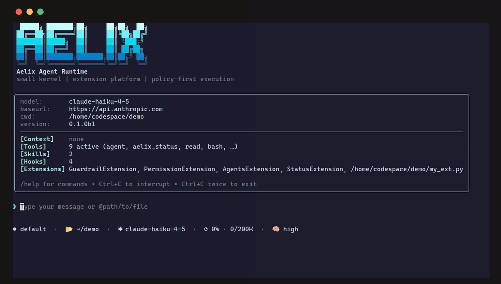

<p align="center">
  
</p>

**Your own agent world — built on the Python ecosystem.**

An agent runtime and extension platform in pure Python — self-hosted, auditable, and
extensible in the language your team already writes, on the model budgets you already pay for.

[한국어 README →](README.ko.md)

[](LICENSE)
[](https://www.python.org/)

<p align="center">
  
</p>
<p align="center"><em>The agent extends itself: it authors a pandas <code>describe_dataset</code> tool into <code>my_ext.py</code>, <code>/reload</code> hot-loads it without restarting, and the very next prompt runs it in-process. Waits are fast-forwarded.</em></p>

Aelix ships today as a terminal agent built on that runtime — its first workload, not its
boundary. Read every line it runs, keep it entirely inside your own perimeter, and extend it
with plain Python functions that import your existing stack — pandas, an internal SDK, a
warehouse client — directly, in-process: the reason data and ML teams reach for it first.
And it sends nothing about you anywhere — no telemetry, ever. The one request Aelix makes
for itself is a daily check for a newer release, which you can turn off in `/settings` or
skip with `--offline`.

---

## Why Aelix

- 🐍 **Extensions are just Python.** A tool is a plain function — no plugin language, no
  out-of-process bridge. Drive the agent from a terminal, a notebook, a pipeline, or CI.
  [See the example ↓](#extensions-are-just-python--call-your-data-stack-in-process)
- 💳 **Runs on the budget you already own.** Native adapters for Anthropic, OpenAI,
  Gemini/Vertex, OpenRouter, Cloudflare, and GitHub Copilot — including the individual,
  Business, or Enterprise seat you already sign in with (usage subject to your GitHub
  agreement). Route cheap work and hard reasoning to different models from one session. No
  metered ACUs, no new vendor.
- 🔏 **Publisher signing you can switch on.** A complete Ed25519 provenance toolchain with
  SHA-256 pinning (`extension keygen | sign | trust`), and `extension install
  --require-signature` is fail-closed — an unsigned or untrusted pack is refused outright.
  It is **not** on by default: no first-party keys are provisioned yet, so without that flag
  a missing signature is accepted on first use. See [SECURITY.md](SECURITY.md).
- 🔍 **Auditable & self-hosted.** Fully open source, no telemetry. `--offline` skips the
  first-use `rg`/`fd` download, the extension-catalog fetch, and the update check (it does
  not route model calls — those go to whichever provider you configured). Trust lives in
  code you can read — the answer to *"why run an agent I didn't write?"*
- 🧩 **Extensible to the core.** A small kernel where even policy, permissions, and guardrails
  are swappable built-in extensions, plus one broad `ExtensionAPI` — tools, slash commands,
  providers, message renderers, themes, and your own `/login` flow (SSO / employee-ID) — with
  live hot-reload, no restart.
- ⚙️ **Scriptable & headless.** `--print`, line-delimited `--mode json`, and a `--mode rpc`
  JSONL protocol make Aelix embeddable in pipelines, CI, and evaluation loops — deterministic
  and machine-readable.

## Install

During the beta, Aelix installs from GitHub Releases through a checksum-verified installer.
It bootstraps [uv](https://docs.astral.sh/uv/) if needed, verifies every *Aelix* wheel
against the release's `SHA256SUMS` manifest (any mismatch aborts), then installs the global
`aelix` command pinned to the exact version that manifest named — so the wheels you end up
with are the wheels that were verified. Third-party dependencies resolve from PyPI as usual:

```bash
curl -fsSL https://raw.githubusercontent.com/handochan/aelix-ai/main/install.sh | sh
```

Pin a release with `AELIX_VERSION=v0.1.0-beta.1` (recommended during the beta) and pick
extras with `AELIX_EXTRAS` — default `tui`; empty (`AELIX_EXTRAS=`) installs the headless
CLI only (print / json / rpc).

**Upgrading / uninstalling.** Re-run the same `curl … | sh` line to upgrade: it resolves the
newest release and re-runs the whole checksum-verified install (`uv tool install --force`
makes that idempotent). To remove Aelix, `uv tool uninstall aelix`.

> **PyPI carries a placeholder until GA — use the installer above.** `pip install aelix`,
> `pipx install aelix` and `uv tool install aelix` do **not** fail today, and that is the
> trap: the names are reserved by a deliberate 1.3 kB metadata-only `0.0.0a0` release, so
> those commands report success and install nothing runnable. There is no `aelix` command
> afterwards. Real Aelix ships through GitHub Releases and the checksum-verified installer
> above for the whole beta. The placeholder is a pre-release, so it can never outrank the
> real thing: once the first GA release is published, `uv tool install 'aelix[tui]'` — or
> the `pipx` / `pip` equivalent — resolves it and works as usual.

```bash
aelix                                            # interactive agent (TUI)
aelix --model openai/gpt-4o-mini "summarise this repo"
aelix --print "what files changed?"              # one-shot, headless
aelix --offline                                  # skip rg/fd + catalog fetches
aelix --help
```

On first use of `grep` or `find`, Aelix downloads `ripgrep` and `fd` from their upstream
GitHub Releases into `~/.aelix/agent/bin` (so both tools honour `.gitignore`). These are the only
binaries fetched at runtime, and `--offline` skips them — the system copies on your `PATH`
are preferred when present.

`aelix` needs a provider credential — set `ANTHROPIC_API_KEY` / `OPENAI_API_KEY` /
`OPENROUTER_API_KEY`, launch `aelix` and run `/login` inside the TUI (Copilot / subscription
OAuth), pass `--api-key`, or configure `~/.aelix/agent/models.json`. See the
[providers guide](docs/guides/providers-and-models.md).

If you plan to use agent delegation, prefer an environment variable or `/login`
over `--api-key`. `--api-key` is held in memory by the parent process only, so a
delegated child never receives it — a child resolves its own credential the way
any fresh process does: from `auth.json` (what `/login` writes) and from the
environment it inherits. So it authenticates normally if either of those carries
a key for the provider, and only if neither does will it stop before its first
turn with `No API key found for <provider>`.

## Providers

Hand-written native adapters — no litellm, no generic wrapper layer — with per-provider
behavior branches (OpenRouter and Cloudflare Workers AI ride the shared OpenAI-completions
adapter), so provider-specific details (Anthropic thinking-block replay, per-model
`/responses` vs `/chat/completions` routing, Copilot enterprise host resolution) are
preserved rather than flattened.

| Provider                                            | Status          |
| --------------------------------------------------- | --------------- |
| Anthropic (Messages)                                | ✅ supported    |
| OpenAI (chat completions)                           | ✅ supported    |
| OpenRouter                                          | ✅ supported    |
| GitHub Copilot (individual / Business)              | ✅ supported    |
| GitHub Copilot (Enterprise)                         | 🧪 unverified   |
| OpenAI Responses API                                | 🧪 experimental |
| Google Gemini / Vertex                              | 🧪 experimental |
| Cloudflare Workers AI                               | 🧪 experimental |

Copilot Enterprise is marked unverified because live testing covered a paid individual seat
and a Copilot Business seat only; the endpoint catalog Aelix ships is static, so it is not
guaranteed to match every enterprise host or plan. It may well work — it just has not been
confirmed by us.

Three providers carried in the bundled model catalog have **no adapter in this build** and
cannot run: `amazon-bedrock` (`bedrock-converse-stream`), `azure-openai-responses`, and
`mistral` (`mistral-conversations`). Aelix hides them rather than letting them fail at turn
one, so they do not appear in `--list-models` or the `/model` picker. See the
[providers guide](docs/guides/providers-and-models.md).

## Extensions are just Python — call your data stack in-process

An Aelix extension is just a `setup(aelix)` function. There is no separate plugin language and
no out-of-process bridge, so a tool can import your existing stack and hand results straight
back to the model — this is why Aelix was built for data and ML teams first:

```python
# my_ext.py  —  a data tool in ~20 lines; loads with:  aelix -e ./my_ext.py
from typing import Any
import pandas as pd                       # your own dependency, imported in-process

from aelix_coding_agent.extensions.api import ExtensionAPI
from aelix_agent_core.types import AgentTool
from aelix_ai.tools import ToolExecutionContext, ToolResult
from aelix_ai.messages import TextContent


async def _describe(args: dict[str, Any], context: ToolExecutionContext) -> ToolResult:
    df = pd.read_parquet(args["path"])     # or query your warehouse, call an internal SDK…
    return ToolResult(content=[TextContent(text=df.describe().to_markdown())])


def setup(aelix: ExtensionAPI) -> None:
    aelix.register_tool(AgentTool(
        name="describe_dataset",
        description="Summary statistics for a Parquet/CSV dataset.",
        parameters={
            "type": "object",
            "properties": {"path": {"type": "string", "description": "Path to the dataset."}},
            "required": ["path"],
        },
        execute=_describe,
    ))
```

The same `ExtensionAPI` also registers slash commands, providers, message renderers, themes,
and a custom `/login` flow — and every extension **hot-reloads without restarting the session**.

**Embed it anywhere Python runs.** Drive the agent headlessly from a notebook, an
Airflow/Prefect/Dagster task, or a CI job:

```bash
aelix --print "profile data/train.parquet and flag columns with >5% nulls"
aelix --mode json "run the eval suite and summarise failures"   # line-delimited events
```

See [writing an extension](docs/guides/extension-authoring.md) for the full surface, and
the [Aelix Marketplace](https://handochan.github.io/aelix-marketplace/) — the official
catalog Aelix reads by default. It ships empty for the beta and is open for submissions.

## Trust & self-hosting

Aelix is built for closed networks and customer-site deployment. `--offline` blocks the
outbound calls Aelix itself would make — the `rg`/`fd` tool-binary download, the catalog
fetch, index-less extension installs, and the update check — though it does not touch the
provider you configure, so a closed-network deployment still needs a reachable or self-hosted model
endpoint. The extension catalog browses and installs from a local copy, trust uses local
pins (no online revocation checks), and `register_login_provider` lets an extension add
enterprise SSO / employee-ID auth. Policy and guardrails are enforced as built-in
extensions, so every tool call and context mutation is an observable, auditable hook event.

Distribute and verify extensions with a signed supply chain — trust that survives an
air-gapped install (enforced when you install with `--require-signature`):

```bash
aelix extension install <path | git-url | package[==version]>   # pip-based, --offline capable
aelix extension keygen                                          # publisher Ed25519 key
aelix extension sign <artifact>                                 # detached .aelixsig
aelix extension trust add <key>                                 # trust a verification key
aelix extension install <target> --require-signature            # fail-closed provenance gate
```

One input is deliberately **not** gated: an `AGENTS.md` found anywhere between your working
directory and the filesystem root is read into the system prompt whether or not you trusted
the project, and its text and absolute path then go to whichever model provider you
configured. `--no-context-files` turns that discovery off. Leaving it ungated follows pi's
published policy rather than diverging from it —
[SECURITY.md](SECURITY.md#scope-what-this-project-is) explains what that means in practice,
and what the flag does *not* cover.

## Known limitations (beta)

Five things worth knowing before you point Aelix at something that matters.

**A run has no spend ceiling.** There is no iteration cap, no duplicate-call
detection, and no cumulative token or cost budget — a model that keeps calling
tools keeps costing money until it finishes or you stop it
([#14](https://github.com/handochan/aelix-ai/issues/14),
[#6](https://github.com/handochan/aelix-ai/issues/6),
[#52](https://github.com/handochan/aelix-ai/issues/52)). The backstops that do
exist are real but none of them bound spend: `Esc` aborts the in-flight turn in
the TUI, `GuardrailExtension` hard-denies catastrophic commands issued through
the built-in tools before any permission check (see the next point for what
that does not cover), the context is compacted automatically before it
overflows,
and `bash` times out after 600 s by default (1 h ceiling on an explicit
per-call value). Watch long unattended runs, and prefer a model whose per-token
price you have checked.

**Headless mode auto-approves mutating tools, and the two safety nets only
recognise built-in ones.** `--print`, `--mode json` and `--mode rpc` have no
terminal to draw an approval dialog on, so `write`, `edit` and `bash` execute
without asking — that is precisely what makes them scriptable, and it is the
behaviour the embedding examples above rely on. Both backstops that would
otherwise catch a dangerous call identify "mutating" by a fixed list of
built-in tool names (`bash`, `edit`, `write` and their aliases): a tool
supplied by an MCP server, a skill, or a third-party extension registers under
its own name — MCP prefixes every tool with its server, so `write_file` arrives
as `fs__write_file` — is not on that list, and therefore reaches neither
`GuardrailExtension`'s patterns nor the `--permission-mode plan` block
([#188](https://github.com/handochan/aelix-ai/issues/188)). Read plan mode as a
guardrail over the built-in toolset, not as a guarantee that nothing mutates.
Otherwise a headless run has full write and shell access to the machine it runs
on, with whatever credentials that machine holds. Give it a container, a
sandbox, or a checkout you can throw away.

**One session, one terminal.** Session files are append-only JSONL and every
entry records the id of the entry it follows, but that pointer lives in the
writing process and nothing locks the file
([#137](https://github.com/handochan/aelix-ai/issues/137)). Open the same
session twice — two terminals, or `aelix --continue` twice in one directory —
and the second writer keeps attaching its turns to the leaf it saw at load
time, which the first writer has already moved past. Nothing on disk is
corrupted and every line stays valid JSON, but one terminal's work becomes a
branch that no later `--resume` or `--continue` walks, so it is simply gone
from the transcript. Run one terminal per session until this is fixed.

**Transcripts keep everything, forever, unredacted.** Every prompt, every tool
argument and every tool result is written verbatim into the session JSONL;
there is no scrubbing pass
([#138](https://github.com/handochan/aelix-ai/issues/138)). If the agent runs
`env`, cats a `.env`, or reads a private key, that value is on disk until you
delete the session. The files themselves are owner-only — `0600` inside a
`0700` directory, the same as `auth.json`, and `aelix --export` writes its HTML
with those permissions too — so this is not an exposure to other users of the
machine. It is an exposure to anything that copies your home directory:
backups, sync clients, and support bundles carry the raw values with them.

**Delegation is Linux-first, and its spend is not in `/cost`.** Agent delegation
(`--agents`, `[features] agents`) spawns a real child process, and the process
plumbing is written for POSIX: every spawn passes a `preexec_fn` and the kill
path uses `SIGKILL`, neither of which exists on Windows, so delegation is
unsupported there ([#110](https://github.com/handochan/aelix-ai/issues/110)). On
macOS the child itself is signalled correctly, but the descendant walk reads
`/proc` and therefore finds nothing — anything a delegated agent forks can
outlive it, and a child whose parent is killed outright keeps running. A
headless parent (`--print`, `--mode json`, `--mode rpc`) has no terminal to draw
the spawn-consent dialog on, so it consents on its own: the child still cannot
exceed the parent's own posture or tool grant, but no human is asked. The same
is true interactively in `yolo` posture, which is what `yolo` means — there the
delegation is announced in the status line while it runs, naming the profile,
the posture and the task count, without blocking. And a
child's tokens are billed to the provider without ever entering the parent's
session, so `/cost` reports the parent only — read each delegation's own
`[agent … in / … out]` footer for what a child spent.

## Architecture

Three packages make up the agent (a uv workspace), orchestrated by `Agent` and `AgentHarness`:

- **`aelix-ai`** — provider-agnostic messages, streaming primitives, tool definitions. No loop, no hooks.
- **`aelix-agent-core`** — the agent loop, `Agent`, `AgentHarness`, and the typed `HookBus`. No extension deps.
- **`aelix-coding-agent`** — `ExtensionAPI`, extension loader, built-in `PolicyExtension` / `GuardrailExtension`.

Design principles: small kernel + broad extension surface · policy/guardrails as built-in
extensions, not core · explicit hook bus for auditability. Full rationale in
[`docs/`](docs/README.md).

## Docs

[Getting started](docs/guides/getting-started.md) ·
[Providers & models](docs/guides/providers-and-models.md) ·
[Custom models](docs/guides/models-json.md) ·
[Agent profiles](docs/guides/agent-profiles.md) ·
[Writing an extension](docs/guides/extension-authoring.md) ·
[Project trust](docs/guides/project-trust.md) ·
[Private catalog](docs/guides/private-catalog.md) ·
[Releasing](RELEASING.md)

Every guide above except `RELEASING.md` is also copied into the wheel, so an
installed machine reads them with no network and no checkout:

```bash
aelix docs                          # list the bundled guides
aelix docs project-trust            # print one
aelix docs --search register_tool   # substring search across all of them
```

When the question is about *this directory* rather than about aelix in general —
is it trusted, which of your extensions load here, did one of them fail to
import — `aelix status` answers without starting a session:

```bash
aelix status                        # version, project trust, extensions
aelix status --json                 # the same, for a script
aelix status --no-extensions        # skip discovery; imports no extension code
```

[Homepage →](https://handochan.github.io/aelix-ai/) ·
[Extension catalog →](https://handochan.github.io/aelix-marketplace/)

## Building from source (contributors)

Aelix uses [uv](https://docs.astral.sh/uv/) for environment and dependency management.

```bash
uv sync                  # create .venv and install all workspace packages
uv run pytest            # run the test suite
uv run aelix --help      # the real CLI
```

Copy `.env.example` to `.env` for live-provider credentials (the credential-free demo
`python -m aelix` needs none). A `.env` is read for **provider credentials, plus six
provider-configuration names** — the Google Vertex project and location, the Cloudflare
account and gateway ids, and the OpenRouter default model, each admitted only if its
VALUE is a plain name. Five of those six are there because they decide which models you
can see, so Vertex and both Cloudflare providers keep working from a `.env`; the sixth,
`OPENROUTER_DEFAULT_MODEL`, chooses a model rather than revealing one. (The visibility set
is those five plus `GOOGLE_CLOUD_API_KEY`, which the credential rule already admits — so a
Vertex setup that runs on an API key needs nothing from the config list.) aelix loads the
file before it knows whether it trusts the directory, so a repo you merely cloned cannot
use one to change aelix's configuration. Everything else — CA bundles, SDK knobs, base
URLs — belongs in your shell; see
[ADR-0203](docs/decisions/0203-dotenv-admission-control.md).

## License & attribution

[Apache-2.0](LICENSE) — permissive, with an explicit patent grant.

The **name and logo** are separate from the code licence, as Apache-2.0 §6 says
they are. [TRADEMARK.md](TRADEMARK.md) grants more than §6 does: describing your
work as built on, compatible with, or an extension of Aelix needs no permission,
and neither does naming your package `aelix-<something>`.

Substantial portions of Aelix are a TypeScript-to-Python port of
[pi](https://github.com/earendil-works/pi) (reference commit `734e08e`),
Copyright © 2025 [Mario Zechner](https://github.com/badlogic), MIT licensed. The bundled
model catalog derives from data published by [models.dev](https://models.dev) (MIT).
Full third-party license texts are preserved in [NOTICE](NOTICE) and
[THIRD-PARTY-NOTICES.md](THIRD-PARTY-NOTICES.md), which ship in every wheel and sdist;
the dependency inventory is recorded as a CycloneDX SBOM under [`sbom/`](sbom/).

Anthropic, OpenAI, Google Gemini, GitHub Copilot, OpenRouter, and Cloudflare are
trademarks of their respective owners; Aelix is an independent project, and names are
used only to identify the services it can connect to.
